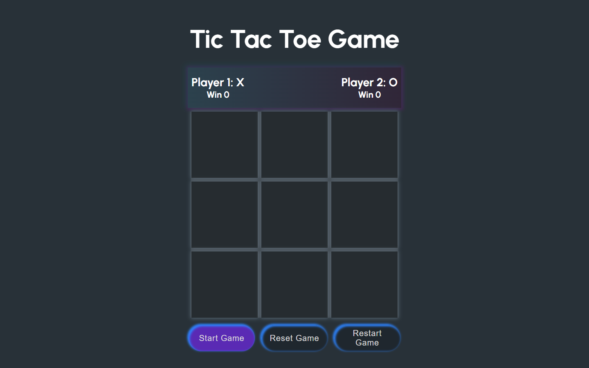

# Tic Tac Toe Game

This project is a simple implementation of the classic Tic Tac Toe game using HTML, CSS, and JavaScript. It allows two players to take turns marking spaces in a 3x3 grid, aiming to get three of their symbols in a row, column, or diagonal.

## Preview

## Play Game

<a href="https://codebyfaisal.github.io/game1/" target="_blank">Project Preview</a>

## How to Play

- Click the "Start Game" button to begin.
- Players take turns clicking on the grid to place their respective symbols (X or O).
- The game alternates between X and O after each valid move.
- The first player to get three of their symbols in a row, column, or diagonal wins the game.
- Use the "Reset Game" button to clear the board and start a new game.
- The "Restart Game" button reloads the page, resetting the game entirely.

## Features

- **Player Information:**
  - Track the wins for Player 1 (X) and Player 2 (O).

- **Game Controls:**
  - Start the game, reset the game board, and restart the game with dedicated buttons.

- **Win Detection:**
  - Automatically detects and displays the winner once a player achieves a winning combination.
  - Highlights the winning combination on the grid.

## How to Use

1. Clone this repository.
2. Open the HTML file in a web browser to play the game.
3. Click on the grid to make moves and enjoy playing Tic Tac Toe!

## Future Improvements

- Refactor the code for better readability and maintainability.
- Implement additional features like sound effects or customizable player names.
- Enhance the user interface with more animations or visual cues.

Feel free to contribute or provide feedback! If you have any questions or suggestions, please reach out.

Enjoy the game! 🎮
